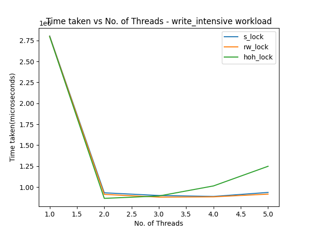
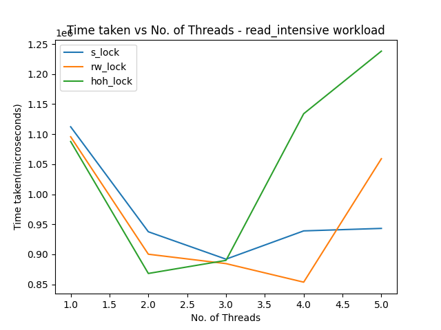
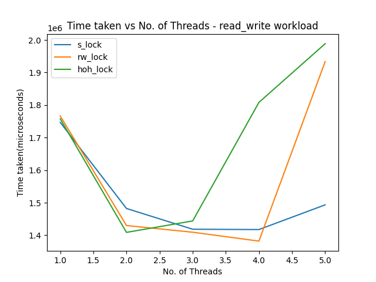
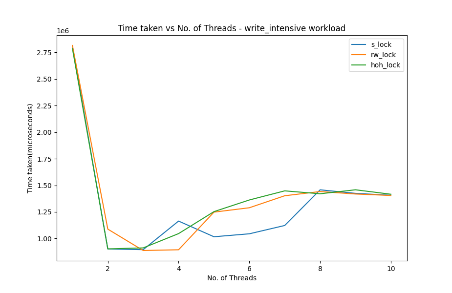
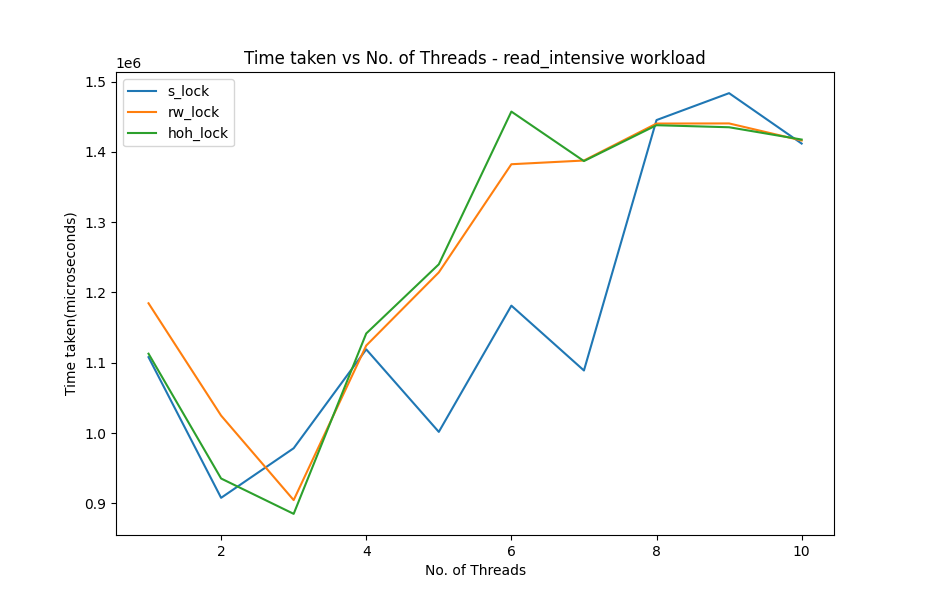
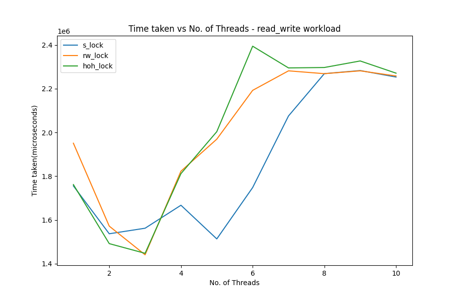
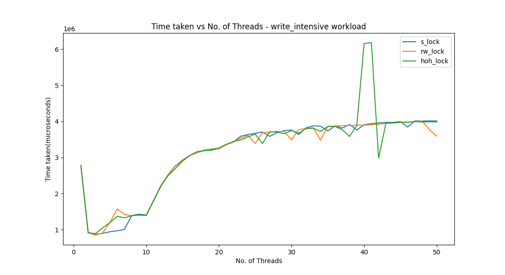
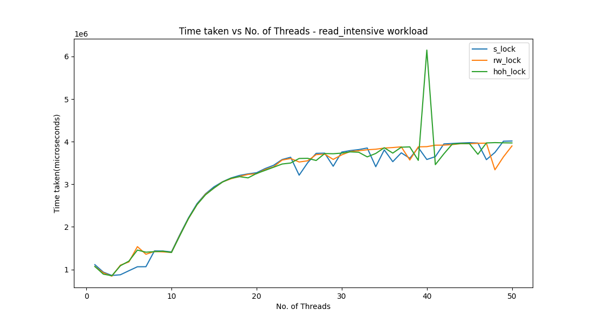
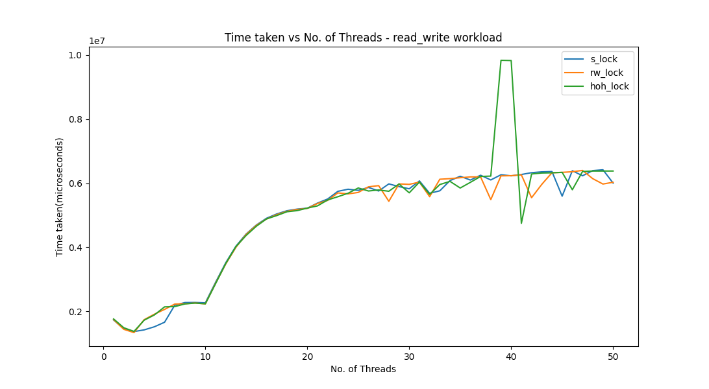

# Assignment 2 Question 1

## Usage  

### Comparing  

To run the workloads, use the following command:  

`make comparison MTC=<max_no_of_threads>`  

For example,  

`make comparison MTC=10`   

The time taken to run the workloads gets written into **comparison/s_lock.csv, comparison/rw_lock.csv** and **comparison/hoh_lock.csv**(in microseconds). 

### Plotting

To both run the workloads and plot the data, use the command:   

`make plot MTC=<max_no_of_threads>`  

For example,  

`make plot MTC=10`   

The plots get saved in the directory **comparison**.  

### Cleaning  

To clean up, use:  

`make cleancomparison`   

## Files and Folders  

I have added the following files and folders:  

### images/  
Contains all images inserted in README.md and plots.md   

### comparison/  
Contains code for comparing the locking methods.  

### comparison/comparison_s_lock.c  
Code for running workloads on s_lock and writing results into a CSV file (The makefile uses this C file to make corresponding C files for rw_lock and hoh_lock by removing 1 or 2 lines from the top of the file). 

### comparison/plot.py  
Python program to plot the data written into CSV files by the comparison C programs.   

## Requirements  

The following 2 Python packages are needed for plotting:  

### matplotlib   

`pip install matplotlib`   

### pandas   

`pip install pandas`   

## Workloads   

All words used in the insert/find operations consist of 10 letters.

### Write-Intensive Workload(80-20 Write-Read)  

Consists of 3628800 insert(write) operations and 907200 find(read) operations.  

### Read-Intensive Workload(20-80 Write-Read) 

Consists of 907200 insert(write) operations and 3628800 find(read) operations.  

### Mixed Read-Write Workload(50-50 Write-Read) 

Consists of 3628800 insert(write) operations and 3628800 find(read) operations.  

## Plots   

### Write-Intensive Workload(80-20 Write-Read)   
  

### Read-Intensive Workload(20-80 Write-Read) 
  

### Mixed Read-Write Workload(50-50 Write-Read) 
  

### Write-Intensive Workload(80-20 Write-Read)   
  

### Read-Intensive Workload(20-80 Write-Read) 
  

### Mixed Read-Write Workload(50-50 Write-Read) 
  

### Write-Intensive Workload(80-20 Write-Read) 
  

### Read-Intensive Workload(20-80 Write-Read) 
  

### Mixed Read-Write Workload(50-50 Write-Read) 
  

## Question  

Your task is to define the implementations of the various functions defined in `trie.h` to implement a [Trie](https://en.wikipedia.org/wiki/Trie). The implementation of the functions must be filled in `trie.c`. The description of what each function is supposed to do is provided in `trie.h`. You can write as many auxilary/helper functions as you want in `trie.c`. Testing code has been provided. You are not allowed to change the function names or parameters in `trie.h` and `trie.c` as they are vital for running the testing code. In `trie.h`, you are only allowed to add additional variables to the structure `_trie_t`.

Your implementation of Trie must to concurrent. There are many ways of doing it but you have to implement three of them: using a single mutex lock for the entire trie, using a reader writer lock and using hand on hand locking. You have to provide all three implementations in this template. You have to use hand on hand locking when `_NO_HOH_LOCK_TRIE` has not been defined. Otherwise, you use single mutex lock when `_S_LOCK_TRIE` has been defined, the reader writer lock when it has not been defined. To accomplish this, look into `#indef` and `#ifndef`. Please ensure that memory leaks are kept to a minimum (the makefile has already been set to run test code using valgrind to make it easier for you to find memory leaks). Please add your own rules in the `Makefile` only after the last line. 

Here are some resources regarding concurrent data structures which might prove helpful:
- [Chapter 29: Lock-based Concurrent Data Structures](http://pages.cs.wisc.edu/~remzi/OSTEP/threads-locks-usage.pdf)
- [Readers-writer Problems](https://en.wikipedia.org/wiki/Readers%E2%80%93writers_problem)
- [Pthread Reader Writer Lock](https://pubs.opengroup.org/onlinepubs/009695399/functions/pthread_rwlock_tryrdlock.html)
- [Different locking techniques for linked list](http://www.cs.technion.ac.il/~erez/courses/seminar/talks/05.pdf)

Furthermore, you have to provide plots to compare the performance of the locking techniques implemented against the following parameters:
- Number of concurrent threads
- Different types of workload:
  1. Write intensive workload
  2. Read intensive workload
  3. Mixed Read / Write workload (50%-50%)
- Size of the tree

Present all your plots in the file `plots.md`.

## Compiling the test code:
- **Single Threaded:** `make test_trie_single_threaded`
- **Multi Threaded (Single Locking):** `make test_trie_s_lock` 
- **Multi Threaded (R/W Lock):** `make test_trie_rw_lock`
- **Multi Threaded (Hand on Hand Lock):** `make test_trie_hoh_lock`

## Compiling and running the tests:
- **Single Threaded:** `make single_threaded`
- **Multi Threaded (Single Locking):** `make s_lock` 
- **Multi Threaded (R/W Lock):** `make rw_lock`
- **Multi Threaded (Hand on Hand Lock):** `make hoh_lock`
