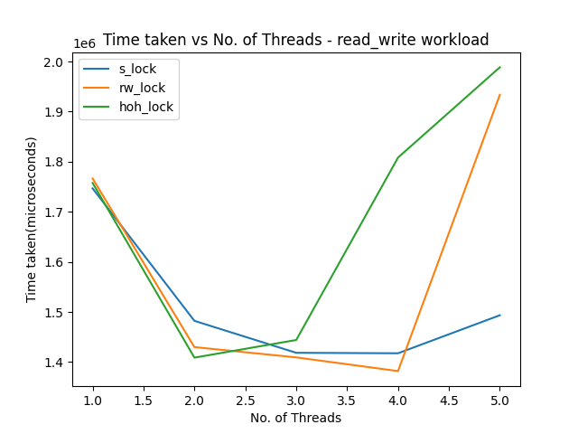
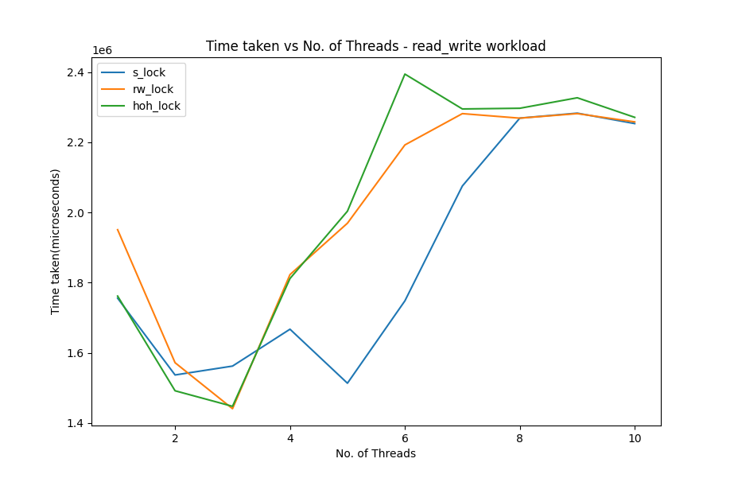
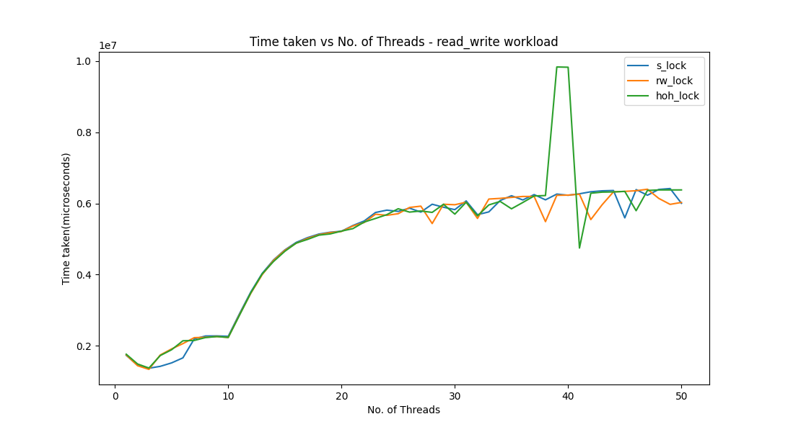

# Comparing locking methods

## Workloads   

All words used in the insert/find operations consist of 10 letters.

### Write-Intensive Workload(80-20 Write-Read)  

Consists of 3628800 insert(write) operations and 907200 find(read) operations.  

### Read-Intensive Workload(20-80 Write-Read) 

Consists of 907200 insert(write) operations and 3628800 find(read) operations.  

### Mixed Read-Write Workload(50-50 Write-Read) 

Consists of 3628800 insert(write) operations and 3628800 find(read) operations.  

## Plots   

### Write-Intensive Workload(80-20 Write-Read)   
  

### Read-Intensive Workload(20-80 Write-Read) 
  

### Mixed Read-Write Workload(50-50 Write-Read) 
  

### Write-Intensive Workload(80-20 Write-Read)   
  

### Read-Intensive Workload(20-80 Write-Read) 
  

### Mixed Read-Write Workload(50-50 Write-Read) 
  

### Write-Intensive Workload(80-20 Write-Read) 
  

### Read-Intensive Workload(20-80 Write-Read) 
  

### Mixed Read-Write Workload(50-50 Write-Read) 
  

