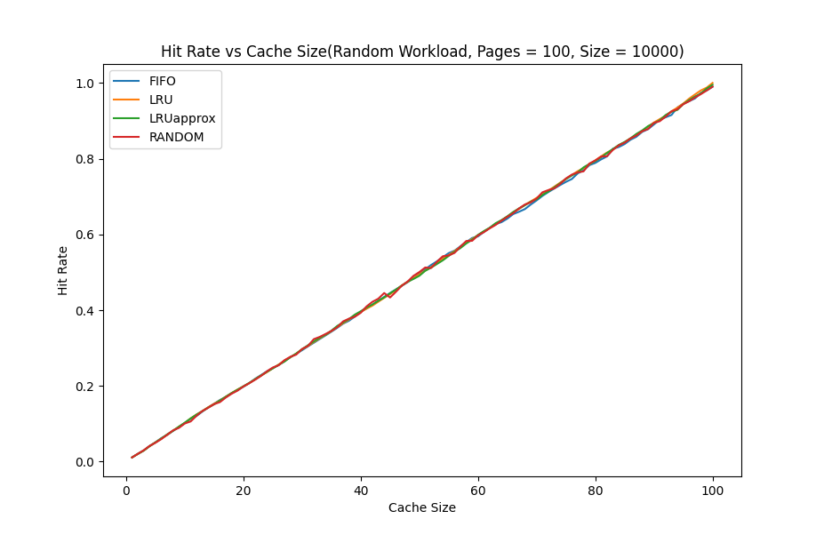
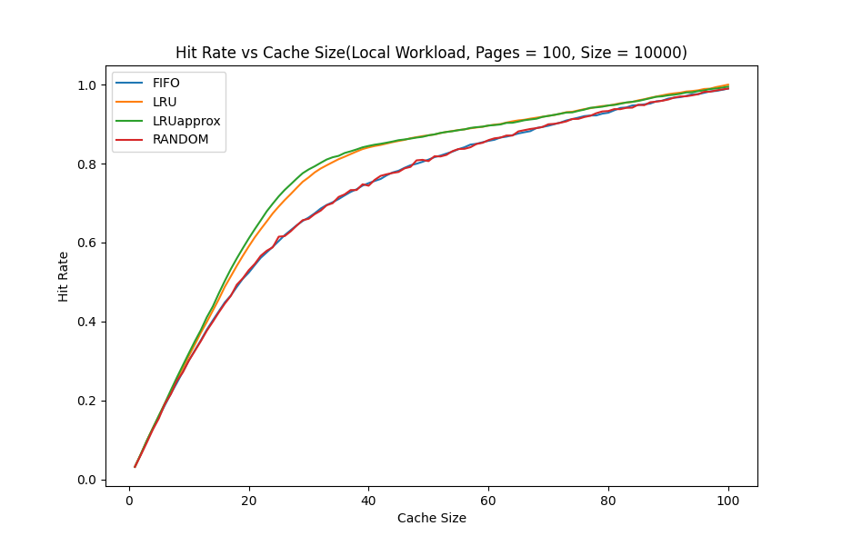
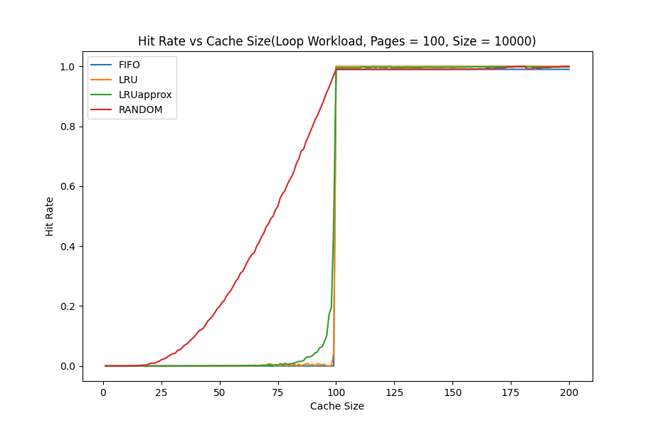

# Assignment 2 Question 2

## Usage

### Compiling  

To compile, use the following command:   

`make`  

A binary named **main** and a folder named **data** will get created.  

### Running   

Once you have compiled and created the binary, use the following command to run it:   

`./main <pages> <size>`    

For example,   

`./main 100 10000`  

The results will be stored in **data/random.csv, data/local.csv** and **data/loop.csv**.

### Plotting  

To plot the data written in the CSV files, use the following command:  

`make plot`  

Plots will be generated and saved in the directory **plots**.  

### Cleaning  

To cleanup, use:  

`make clean`   

## Files and Folders

I have added the following files and folders:

### images/  

Contains all images inserted in README.md  

### plot.py  

Code for plotting the data written into CSV files by main.c

## Requirements  

The following 2 Python packages are needed for plotting:  

### matplotlib   

`pip install matplotlib`   

### pandas   

`pip install pandas`   

## Plots   

### Hit-rate vs Cache size - Random workload, 100 pages, 10000 size   

  

All policies perform almost the same for a random workload.

### Hit-rate vs Cache size - Local(80-20) workload, 100 pages, 10000 size   

  

LRU and Approximate LRU perform better than FIFO and RANDOM policies on a local(80-20) workload.

### Hit-rate vs Cache size - Looping workload, 100 pages, 10000 size   

Random performs best on a looping workload. FIFO, LRU, and Approximate LRU perform very poorly on a looping workload. 

## Performance Comparison   

### FIFO   

FIFO replacement policy was implemented using a queue. Time complexity for a replacement is **O(cache size)**, since it takes **O(cache size)** time to check if the page is present in the cache, and **O(1)** time to enqueue/dequeue a page into/from the cache. The space complexity used is **O(cache size)**.

### RANDOM

RANDOM replacement policy uses the srand() and rand() functions in C. Time complexity for a replacement is **O(cache size)**, since it takes **O(cache size)** time to check if the page is present in the cache, and rand()/srand() is generally considered to be **O(1)** though it may depend on the exact implementation. The space complexity used is **O(cache size)**. 

### LRU  

LRU replacement policy was implemented using an array with each cache entry having an additional piece of information to denote how recently it was used(just the value of a count variable). Time complexity for a replacement is **O(cache size)**, since it takes **O(cache size)** time to check if the page is present in the cache, and **O(cache size)** time to find the least recently used cache entry. The space complexity used is **O(cache size)**. 

### Approximate LRU

Approximate LRU replacement policy was implemented using an array with each cache entry having an additional use bit. Time complexity for a replacement is **O(cache size)**, since it takes **O(cache size)** time to check if the page is present in the cache, and **O(cache size)** time to find the least recently used(approximately) cache entry. The space complexity used is **O(cache size)**. 

## Question  

In this question, complete individual files and implement in C and compare the various policies for caching. 

**Do not change or remove the already defined functions and the defined functions should behave according to the given instructions.**

You will be implementing: 

Policies: LRU (exact and approx), FIFO, Random
Workloads: 80-20, looping, random

1. Add required header files in each of the files and mention why they are required.
2. The makefile given this time is empty. Complete it!
3. Read the instructions given in each file.
4. If you add any extra function, do not forget to mention it in definitions header file.
5. Add comments to describe what is going on in each function.
6. The work in workload corresponds to a the sequence of pages where each page is represented by an integer.

*Note: In the code, 80-20 is mentioned as local.*
